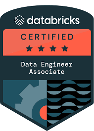

### Hi there 👋  I'm a AI & Data Engineering Lead Building AI-powered products and helping Clients.
### Skills

Python,HTML5,MongoDB,SQL,hive,ADF,Databricks,PowerBI,ML,Azure Synapse,AWS,Pyspark

- 🔭 I’m currently working as  AI & Data Engineering Lead 
- 🌱 I’m Activekly working on AI/ML and working on real time projects
- 👯 I’m looking to collaborate on Datascience and ML discussions/solutions
- 💬 Ask me about Data science,python,ML,Agentic AI
- 📫 How to reach me: santhimaddipudi@gmail.com
- ⚡ Fun fact: Always ready to work with Data problems and find solutions to them

### Socials

 
 

Innovative Data Professional with 15+years of experience in Software Development and Data Science. Working on reinforcing business solutions with Artificial Intelligence. Eager to bring expertise to solve new challenging problems.

• 15+ years of experience in Software Development including Analysis, Design, Development, and Testing of various applications in cloud and onpremise applications.

• Experience in Functional and Object-Oriented Programming styles of Python.

• Expertise is end to end data analysis,transformation,Reporting technologies and frameworks.

• In-depth understanding of Python and ML.

• Knowledge of Service Oriented Architecture (SOA).

• Innovative Data Scientist with 6+ years of experience in Software Development and Data Science. Working on reinforcing business solutions with Artificial Intelligence. Eager to bring expertise to solve new challenging problems.

• 14+ years of experience in Software Development including Analysis, Design, Development, and Testing of various applications in JavaScript and Python environments.

• Experience in Functional and Object-Oriented Programming styles of Python and Javascript.

• Expertise in Full python libraries like Pandas,Numpy,matplotlib,seaborn,scikit.

• In-depth understanding of Python and JavaScript.

• Knowledge of Service Oriented Architecture (SOA).

• Worked for industry clients and have experience working with healthcare, banking  and Oil & Gas domains.

### Tools | Frameworks

Web: MongoDB, GraphQL

Data Preprocessing: NumPy, Pandas,pyspark.

Database : Oracle,SQL server,Postgress

Machine and Deep Learning Implementation Framework: Scikit-Learn, PyTorch.

Natural Language Processing: NLTK, BERT. Development: Python, Flask, Django, Git.

Data Visualization: Matplotlib, Tableau, Seaborn,Power BI.

Cloud Services: Google Colaboratory, Kaggle kernel.

ETL technolgies: ADF,Databricks,Pyspark,Synapse Analytics,Snowflake,Talend,SSIS,Databricks

Integrated Development Environment: Jupyter-Notebook, Spider Notebook.

### Skills

### Badges/Certifications

 

