### Hi there 👋  I'm a AI & Data Engineering Lead Building AI-powered products and helping Clients.

- 🔭 I’m currently working as  AI & Data Engineering Lead 
- 🌱 I’m Activekly working on AI/ML and working on real time projects
- 👯 I’m looking to collaborate on Datascience and ML discussions/solutions
- 💬 Ask me about Data science,python,ML,Agentic AI
- 📫 How to reach me: santhimaddipudi@gmail.com
- ⚡ Fun fact: Always ready to work with Data problems and find solutions to them

### Socials

 
 
 
 

Innovative Data Professional with 15+years of experience in Software Development and Data Science. Working on reinforcing business solutions with Artificial Intelligence. Eager to bring expertise to solve new challenging problems.

• 15+ years of experience in Software Development including Analysis, Design, Development, and Testing of various applications in cloud and onpremise applications.

• Experience in Functional and Object-Oriented Programming styles of Python.

• Expertise is end to end data analysis,transformation,Reporting technologies and frameworks.

• In-depth understanding of Python and ML.

• Knowledge of Service Oriented Architecture (SOA).

• Innovative Data Scientist with 6+ years of experience in Software Development and Data Science. Working on reinforcing business solutions with Artificial Intelligence. Eager to bring expertise to solve new challenging problems.

• Worked for industry clients and have experience working with banking,Insurance,Oil & Gas domains.

### Tools | Frameworks

Web: MongoDB, GraphQL

Data Preprocessing: NumPy, Pandas,pyspark.

Database : Oracle,SQL server,Postgress

Machine and Deep Learning Implementation Framework: Scikit-Learn, PyTorch.

Natural Language Processing: NLTK, BERT. Development: Python, Flask, Django, Git.

Data Visualization: Matplotlib, Tableau, Seaborn,Power BI,Microsoft Fabric,Powerapps

Cloud Environments : Azure,AWS

Cloud Services: Google Colaboratory, Kaggle kernel.

ETL technolgies: ADF,Databricks,Pyspark,Synapse Analytics,Talend,SSIS,Databricks,AWS Glue,Amazon EMR,Amazon Redshift

AI/ML Cloud tools: Azure MLstudio,Amazon Bedrock,Amazon sagemaker.

Integrated Development Environment: Jupyter-Notebook, Spider Notebook,VS code.

### Skills

<a href="https://developer.mozilla.org/en-US/docs/Glossary/HTML5" target="_blank" rel="noreferrer">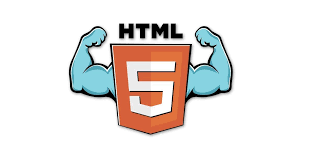</a>
<a href="https://reactjs.org/" target="_blank" rel="noreferrer">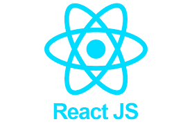</a>
<a href="https://www.w3.org/TR/CSS/#css" target="_blank" rel="noreferrer">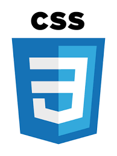</a>

<a href="https://nodejs.org/en/" target="_blank" rel="noreferrer">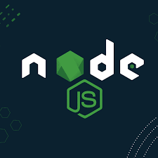</a>
<a href="https://graphql.org/" target="_blank" rel="noreferrer">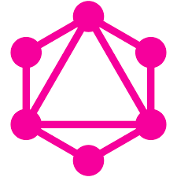</a>
<a href="https://app.fabric.microsoft.com/" target="_blank" rel="noreferrer">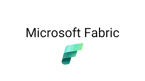</a>
<a href="https://ai.azure.com/" target="_blank" rel="noreferrer">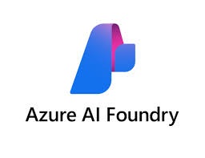</a>

<a href="https://www.tableau.com/" target="_blank" rel="noreferrer">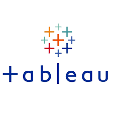</a>

<a href="https://www.oracle.com/" target="_blank" rel="noreferrer">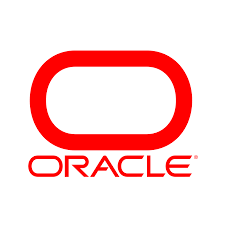</a>

<a href="https://azure.microsoft.com/en-us/products/azure-sql/" target="_blank" rel="noreferrer">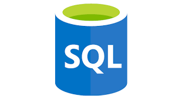</a>
<a href="https://azure.microsoft.com/" target="_blank" rel="noreferrer">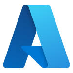</a>

⚡ Understand business requirements and deliver effective, reliable solutions that ensure smooth and efficient business operations. 

⚡ Developed data pipeline and flow with DevOps on Azure and AWS for various clients. 

⚡ Worked with data, applying statistical models, designing the flow of the data product, and monitoring the end-to-end products. 

⚡Worked on different projects in multiple domains like Banking, Oil&Gas, Insurance domains

⚡ Solved complex problems with ML&AI and implemnted various use cases for business problems. 

### Badges/Certifications

 
<a href="https://github.com/santhimaddipudi/santhimaddipudi/blob/main/DB_ML_Professional.pdf" target="_blank" rel="noreferrer">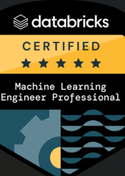</a>
<a href="https://github.com/santhimaddipudi/santhimaddipudi/blob/main/DB_DataEngineer_Professional.pdf" target="_blank" rel="noreferrer">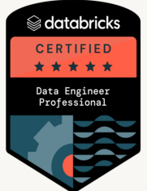</a>
<a href="https://github.com/santhimaddipudi/santhimaddipudi/blob/main/databricks_dataanalyst.pdf" target="_blank" rel="noreferrer">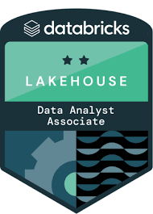</a>
<a href="https://github.com/santhimaddipudi/santhimaddipudi/blob/main/Databricks%20GenAI_Santhi.PNG" target="_blank" rel="noreferrer">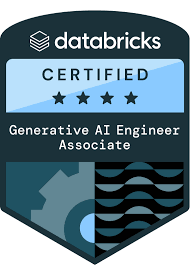</a>
<a href="https://github.com/santhimaddipudi/santhimaddipudi/blob/main/santhi_databricks_solutionarchitect.pdf" target="_blank" rel="noreferrer">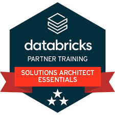</a>
<a href="https://github.com/santhimaddipudi/santhimaddipudi/blob/main/Azure%20data%20scientist%20associate.pdf" target="_blank" rel="noreferrer">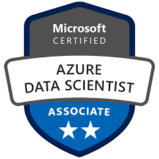</a>
<a href="https://github.com/santhimaddipudi/santhimaddipudi/blob/main/fabric.pdf" target="_blank" rel="noreferrer">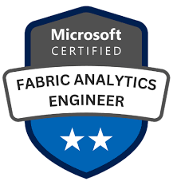</a>

